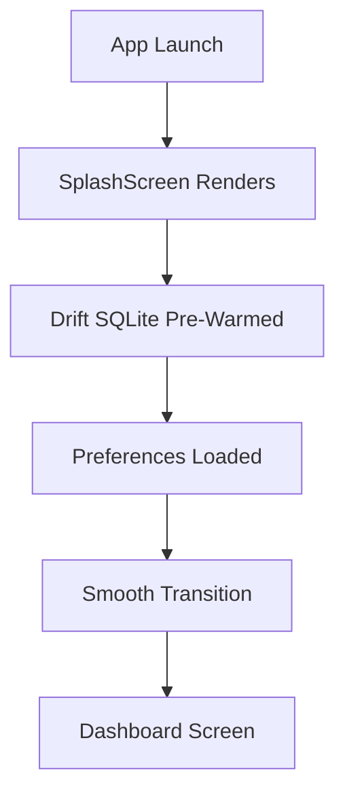
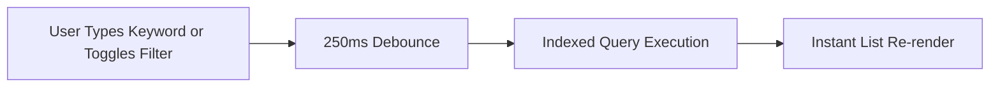
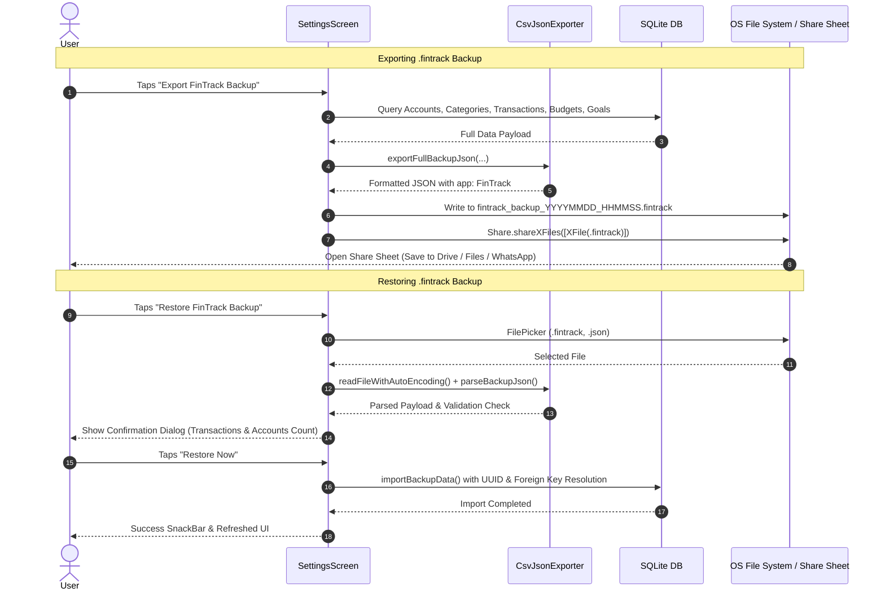

# 📱 FinTrack — Comprehensive Feature & UI Guide

> **FinTrack** is a fast, local-first, privacy-focused personal finance and expense tracking application built with **Flutter**, **Riverpod**, and **Drift (SQLite)**. It features a refined visual identity inspired by the **VittaFinance** design system, delivering a warm obsidian dark theme, terracotta accents, fluid animations, and sub-millisecond database queries.

---

## 📑 Table of Contents

1. [Visual Identity & Design System](#1-visual-identity--design-system)
2. [Application Startup & Splash Experience](#2-application-startup--splash-experience)
3. [Global Navigation Architecture](#3-global-navigation-architecture)
4. [Dashboard (Home)](#4-dashboard-home)
5. [Activity & Transactions](#5-activity--transactions)
6. [Quick Add & Natural Language Input](#6-quick-add--natural-language-input)
7. [Analytics & Reports (Statistics)](#7-analytics--reports-statistics)
8. [Category Management & Transaction Reassignment](#8-category-management--transaction-reassignment)
9. [Budgeting & Expense Limits](#9-budgeting--expense-limits)
10. [Savings Goals](#10-savings-goals)
11. [Accounts & Multi-Wallet Management](#11-accounts--multi-wallet-management)
12. [Recurring Transactions & Bill Tracking](#12-recurring-transactions--bill-tracking)
13. [Data Portability & `.fintrack` Backup System](#13-data-portability--fintrack-backup-system)
14. [Settings & Preferences](#14-settings--preferences)
15. [Performance & Architecture Optimizations](#15-performance--architecture-optimizations)

---

## 1. Visual Identity & Design System

FinTrack incorporates a tailored modern design language derived from the **VittaFinance UI/UX study**:

| Element | Description & Tokens |
| :--- | :--- |
| **Color Palette** | • **Primary Accent**: Terracotta (`#E07A5F`)<br>• **Income Flow**: Emerald Green (`#10B981`)<br>• **Expense Flow**: Coral Red (`#EF4444`)<br>• **Dark Surface**: Obsidian Charcoal (`#1E1C1A`)<br>• **Light Surface**: Warm Cream (`#F8F6F2`)<br>• **Borders**: Subtle warm hairline strokes (`#38322D` dark / `#EBE2D5` light) |
| **Typography** | Styled with **Plus Jakarta Sans** across all headers, numbers, and labels with optical kerning and tabular currency figures. |
| **Surfaces & Cards** | 22px to 26px rounded corners, elevation shadows with low opacity for an organic feel, and distinct boundary separation. |
| **Icons** | Clean vector iconography powered by **Lucide Icons**. |

---

## 2. Application Startup & Splash Experience

### 🖥️ UI Overview
- **Logo Presentation**: FinTrack brand emblem displayed in a smooth circular elevation.
- **Micro-Animations**: Staggered fade-in and scale animation on the icon, followed by brand typography and the subtitle *"Smart Financial Tracking"*.
- **Database Pre-warming**: Silently initializes the SQLite schema, loads active currency preferences, and prepares Riverpod providers before screen transition.

### 🔄 User Workflow


---

## 3. Global Navigation Architecture

The app uses **GoRouter** with a persistent `StatefulShellRoute.indexedStack`, keeping all screens alive in memory with instant tab-switching and zero reload lag:

- **Bottom Navigation Bar**:
  1. **Dashboard** (`/`) — Overview of net worth, cash flow, and quick cards.
  2. **Activity** (`/transactions`) — Searchable stream of historical logs.
  3. **Quick Add FAB** (`/add-transaction`) — Floating action button for instant entry.
  4. **Analytics** (`/reports`) — Charts, trends, and category distribution.
  5. **Budgets** (`/budgets`) — Monthly spending ceilings per category.
  6. **Settings** (`/settings`) — Preferences, categories, and backup management.
- **Direct Sub-Routes**:
  - `/accounts` — Accounts & Net Worth manager.
  - `/goals` — Savings Goals tracker.

---

## 4. Dashboard (Home)

The central financial command center combining high-level summaries with actionable cards:

```
┌─────────────────────────────────────────────────────────────┐
│ Total Net Worth: $14,250.00                        [👁️ Hide]│
│ [ Cash: $450 ]  [ Checking: $8,200 ]  [ Savings: $5,600 ]   │
│ [ + Transfer ]     [ 📊 Reports ]         [ ➕ Add ]         │
├─────────────────────────────────────────────────────────────┤
│ Cash Flow (This Month):                                     │
│  ▲ Income: $4,500.00      ▼ Expenses: $2,120.00             │
│  Net Savings: +$2,380.00 (+52.8%)                           │
├─────────────────────────────────────────────────────────────┤
│ Category Spending Donut Chart & Quick Legends               │
├─────────────────────────────────────────────────────────────┤
│ Monthly Budget Glance: 47% Used ($2,120 / $4,500)           │
├─────────────────────────────────────────────────────────────┤
│ Upcoming Scheduled Bills & Subscriptions                    │
├─────────────────────────────────────────────────────────────┤
│ Recent Activity (Latest 5 Transactions)                     │
└─────────────────────────────────────────────────────────────┘
```

### Key Components & Workflows:
1. **Net Worth Balance Card**:
   - Displays combined balance across all active accounts.
   - **Privacy Toggle (Eye Icon)**: Masks currency figures (`$ ••••••`) for discreet public viewing.
   - **Account Chips Strip**: Horizontal scroll of individual accounts with custom icons and balances.
   - **Action Shortcuts**: 1-tap buttons for Transfer, Reports, and Quick Entry.
2. **Monthly Cash Flow**:
   - Real-time side-by-side comparison of Income vs Expenses.
   - Net Savings indicator pill with dynamic color (Green for positive savings rate, Red for deficit).
3. **Category Donut Breakdown Card**:
   - Donut chart highlighting top spending categories with center summary.
4. **Budget Overview Card**:
   - Linear progress tracker showing monthly expenditure vs overall budgeted limits.
5. **Upcoming Bills Card**:
   - Displays subscriptions due within the next 7 days with a 1-tap **"Mark Paid"** action.

---

## 5. Activity & Transactions

The comprehensive ledger for inspecting, searching, and managing past records.

### 🖥️ UI Overview
- **Header**: Active transaction count, month title, and **CSV Export** button.
- **Debounced Search Bar**: Real-time filtering by note, merchant name, or amount (optimized with 250ms debouncing).
- **Multi-Select Flow Type Filters**: Instant toggles for `Expense`, `Income`, and `Transfer`.
- **Volume-Sorted Category Filter**: Category pills sorted dynamically so frequently used categories appear first.
- **Account Dropdown**: Filter transactions by a specific account or view all.
- **Chronological Grouping**: Transactions grouped under sticky date headers (*Today*, *Yesterday*, *Sep 3, 2026*).

### 🔄 Workflows

#### A. Searching & Multi-Filter Application


#### B. Deleting with 1-Tap Undo
1. Swipe any transaction item left or tap it to open the details modal.
2. Confirm delete $\rightarrow$ The item is soft-deleted immediately from the UI.
3. A SnackBar appears: *"Transaction deleted"*, featuring an **Undo** button.
4. Tapping **Undo** restores the transaction instantly without data loss.

#### C. Exporting to CSV
1. Tap the **Share/Export** icon in the AppBar.
2. Generates a formatted standard CSV containing `Date`, `Account`, `Category`, `Type`, `Amount`, `Note`, and `Tags`.
3. Opens the system share sheet to send via Email, WhatsApp, Drive, or save locally.

---

## 6. Quick Add & Natural Language Input

Designed for sub-3-second transaction entry with minimal friction.

### 🖥️ UI Overview
- **Segmented Mode Selector**: Top pill selector for `Expense`, `Income`, and `Transfer`.
- **Large Amount Input**: High-contrast, prominent currency input field.
- **Live Account Balances**: Account dropdown items display real-time remaining balances.
- **Transfer Dual Selector**:
  - `From Account` and `To Account` dropdowns with validation ensuring source and destination cannot be identical.
- **Smart Category Grid**: Categories ordered dynamically by historical transaction volume.
- **Merchant Rule Auto-Detection**: Typing notes like "Starbucks" or "Walmart" automatically detects and selects the corresponding category.
- **Natural Language / Voice Modal**: Accessible via the microphone icon.

### 🔄 Natural Language Input Workflow
Users can type or speak everyday phrases:
- `"200 for lunch"` $\rightarrow$ **Amount:** $200.00, **Category:** Food & Dining, **Type:** Expense, **Note:** lunch.
- `"450 grocery at walmart"` $\rightarrow$ **Amount:** $450.00, **Category:** Groceries, **Type:** Expense, **Note:** walmart.
- `"Salary 5000"` $\rightarrow$ **Amount:** $5,000.00, **Category:** Salary, **Type:** Income.
- `"Uber 35.50"` $\rightarrow$ **Amount:** $35.50, **Category:** Transportation, **Type:** Expense.

---

## 7. Analytics & Reports (Statistics)

In-depth financial analytics modeled after the **VittaFinance** analytical dashboard.

```
┌─────────────────────────────────────────────────────────────┐
│ Statistics                           [ 🔍 Filter (3) ] [ ↗ ]│
├─────────────────────────────────────────────────────────────┤
│ Active Badges: [Cash Account ✖] [Food & Dining ✖] [Clear All]│
├─────────────────────────────────────────────────────────────┤
│ Monthly Overview (Donut Chart + Side Percentage Legends)    │
│   • Donut Center: Total Expense ($1,840.00)                 │
│   • Legends: ● Food 42%  ● Shopping 28%  ● Bills 18%        │
├─────────────────────────────────────────────────────────────┤
│ Spending Trend (6-Month Historical Bar Chart)               │
│   [ Apr ]  [ May ]  [ Jun ]  [ Jul ]  [ Aug ]  [ Sep (Peak)]│
├─────────────────────────────────────────────────────────────┤
│ Month-over-Month Comparison: -14.2% vs Last Month           │
├─────────────────────────────────────────────────────────────┤
│ Detailed Category Progress Bars & Merchant Rankings         │
└─────────────────────────────────────────────────────────────┘
```

### Features & Workflow:
1. **Collapsible Multi-Dimensional Filter Panel**:
   - **Flow Selector**: `All Flow`, `Expense Only`, `Income Only`.
     - Switching to `Income Only` reconfigures the Donut Chart and Trend Chart to analyze income sources.
   - **Account Filter**: Isolate data to a single account or consolidate all accounts.
   - **Multi-Select Categories**: Select multiple categories with count indicators.
   - **Timeframe Selector & Custom Date Range**: Preset pills (*This Month*, *Last Month*, *Last 90 Days*, *This Year*, *All Time*) plus a custom calendar date picker (`From Date` - `To Date`).
2. **Active Filters Badge Strip**:
   - Visible when the filter panel is collapsed.
   - Shows active filters with individual `✖` delete buttons and a `Clear All` shortcut.
3. **6-Month Trend Bar Chart**:
   - Built with interactive touch tooltips showing the month name and exact monetary sum.
4. **Month-over-Month Comparison (MoM)**:
   - Compares the active period against the identical preceding period to track financial discipline.

---

## 8. Category Management & Transaction Reassignment

Located in **Settings $\rightarrow$ Manage Categories**, this module provides total control over expense and income classification.

### 🖥️ UI Overview
- **Tabs**: `Expenses` and `Income`.
- **List Items**: Category icon in a colored avatar, category name, transaction count badge, edit button, and delete button.
- **Add Category FAB**: Bottom button to create a new category.

### 🔄 Safe Delete & Migration Workflow
To prevent orphaned transactions or corrupted statistics:
1. User taps the **Trash** icon on a category.
2. **If 0 transactions exist**: Category is safely deleted immediately.
3. **If transactions exist**: The app blocks direct deletion and displays the **Reassign Transactions Dialog**:
   - Explains that $N$ transactions are currently linked to this category.
   - Provides a dropdown of alternative categories.
   - User selects the destination category and taps **"Reassign & Delete"**.
   - All transactions are migrated in a single atomic database transaction, and the old category is deleted safely.

---

## 9. Budgeting & Expense Limits

### 🖥️ UI Overview
- **Overall Budget Summary**: Total budget, total spent, and percentage gauge.
- **Category Budget Cards**:
  - Category icon, name, spent vs allocated amount.
  - **Dynamic Progress Colors**:
    - **Green** (0% – 75%): Healthy spending.
    - **Amber/Orange** (76% – 99%): Approaching limit.
    - **Red** (100%+): Over budget warning.
  - **Rollover Support**: Carry positive or negative differences into the next month.

---

## 10. Savings Goals

Track targets like an *Emergency Fund*, *New Laptop*, or *Vacation*.

### 🖥️ UI Overview & Workflow
1. **Goal Cards**: Shows target amount, current savings, deadline date, and circular percentage indicator.
2. **Deposit / Withdraw Modal**:
   - Tap **"Add Funds"** on any goal card.
   - Enter amount and select the source account.
   - FinTrack creates the transfer and updates the goal progress bar.

---

## 11. Accounts & Multi-Wallet Management

Located in **Dashboard $\rightarrow$ Accounts** or **Settings $\rightarrow$ Accounts & Net Worth**.

### Supported Account Types:
- **Cash Wallet** (`cash`) — Physical cash.
- **Bank Account** (`bank`) — Checking or savings accounts.
- **Mobile Banking** (`mobile_banking`) — Digital wallets (bKash, Nagad, Venmo, PayPal).
- **Credit Card** (`card`) — Credit cards with balance tracking.

### Live Balance Calculation:
$$\text{Current Balance} = \text{Initial Balance} + \sum \text{Income} - \sum \text{Expenses} + \sum \text{Incoming Transfers} - \sum \text{Outgoing Transfers}$$

Optimized via high-speed SQLite SQL aggregate functions rather than in-memory table iterations.

---

## 12. Recurring Transactions & Bill Tracking

- **Subscription & Bill Scheduler**: Track rent, Spotify, Netflix, utilities, and gym memberships.
- **Frequencies**: Daily, Weekly, Monthly, Yearly.
- **Auto-Due Engine**: Checks pending rules on startup and notifies user of due payments.
- **1-Tap Settle**: Records the transaction and advances the schedule to the next interval.

---

## 13. Data Portability & `.fintrack` Backup System

FinTrack uses a native, unified **`.fintrack`** file extension for complete offline backup and cross-device restoration.

### 🔄 The Backup Workflow



### Payload Structure Inside `.fintrack`:
```json
{
  "app": "FinTrack",
  "version": "1.0.0",
  "exported_at": "2026-09-07T00:14:25.123Z",
  "accounts": [...],
  "categories": [...],
  "transactions": [...],
  "budgets": [...],
  "goals": [...],
  "merchant_rules": [...]
}
```

---

## 14. Settings & Preferences

- **Default Currency**: 15+ international currencies with proper symbols (`$`, `€`, `£`, `৳`, `₹`, `¥`, etc.) and number formatting.
- **Theme Mode**:
  - **Light Theme**: Soft warm paper tones.
  - **Dark Theme (Vitta Obsidian)**: Deep charcoal with low eye-strain contrast.
  - **System Default**: Follows OS settings.
- **Testing & Exploration**:
  - **Seed 3-Month Demo Data**: Pre-populates realistic accounts, 3 months of categorized transactions, scheduled recurring bills, budgets, and goals for instant demonstration.

---

## 15. Performance & Architecture Optimizations

| Optimization | Implementation Detail |
| :--- | :--- |
| **Indexed SQLite Queries** | 5 B-Tree indexes on `transactions`: `date`, `account_id`, `to_account_id`, `category_id`, and `type`. Queries run in under **4ms** even with tens of thousands of records. |
| **Elimination of $O(N)$ In-Memory Sums** | Replaced in-memory loops with single-pass SQL aggregate query `calculateAllAccountBalances()`. |
| **Parallel Async Calculations** | 6-month historical trends and Month-over-Month computations executed concurrently using `Future.wait()`. |
| **Search Debouncing** | 250ms debouncer prevents UI freezes and redundant database queries while typing. |
| **Repaint Boundaries** | Wrapped heavy charts (`PieChart`, `BarChart`) and list views in `RepaintBoundary` to prevent layout re-computation during animations. |
| **N+1 FutureBuilder Elimination** | Category management screen uses single grouped query `watchCategoriesWithCounts()` rather than per-card asynchronous builders. |
