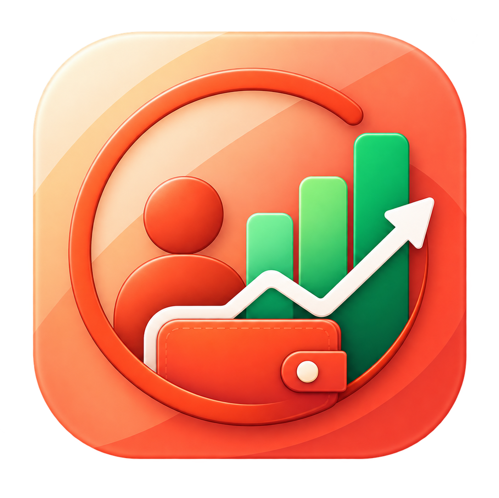
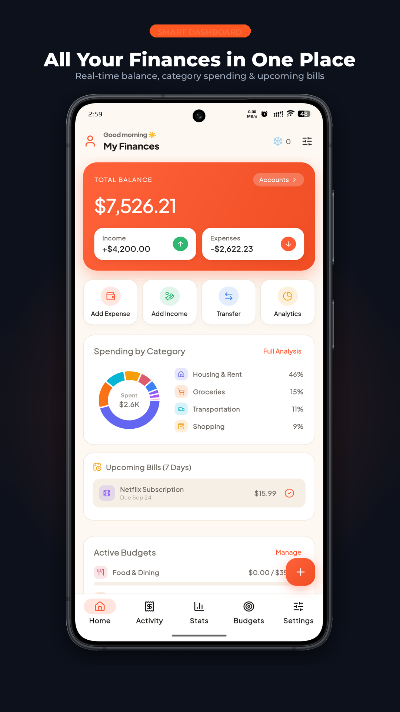
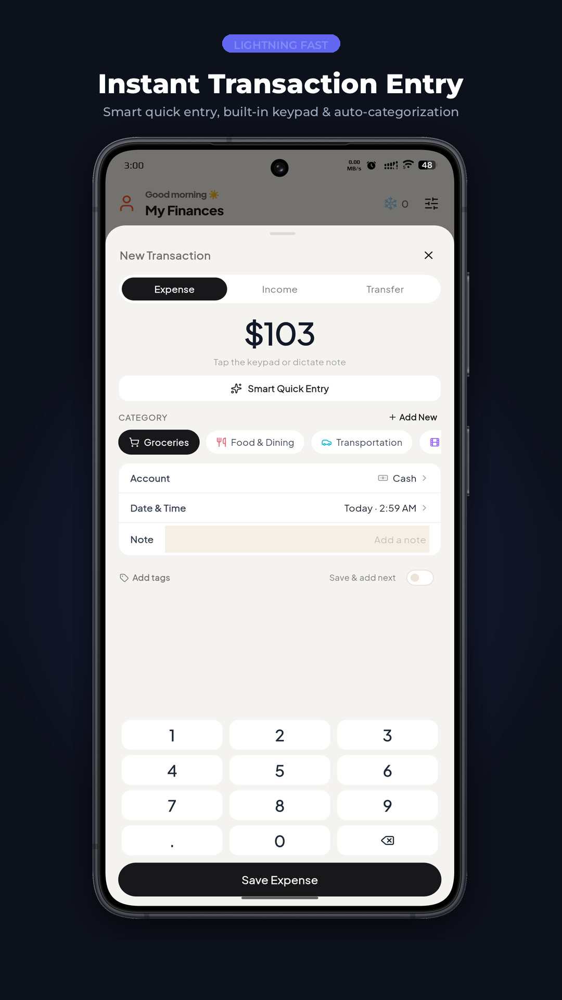
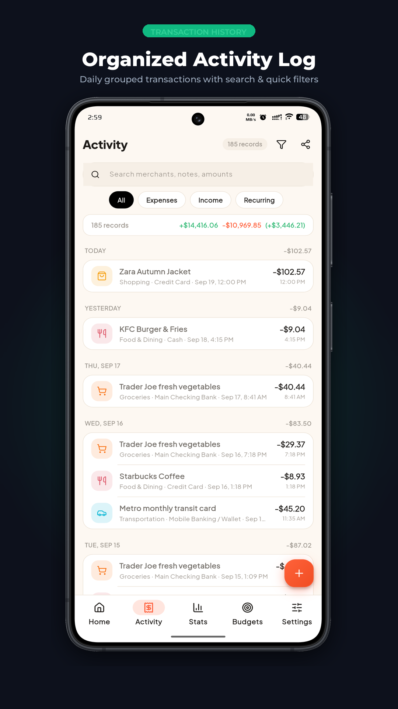
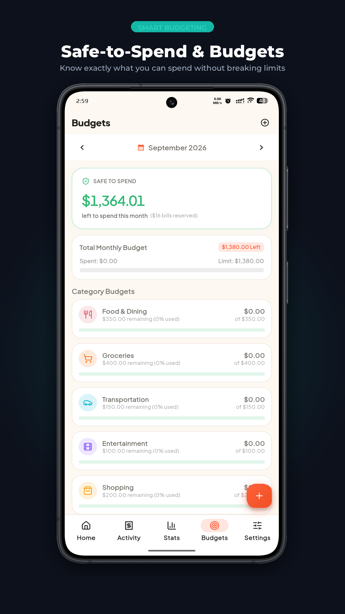
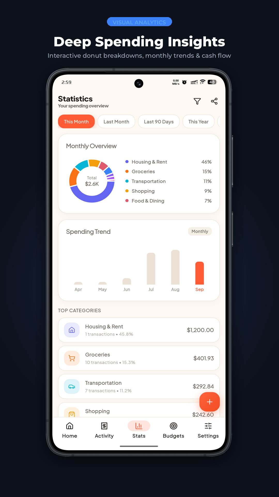
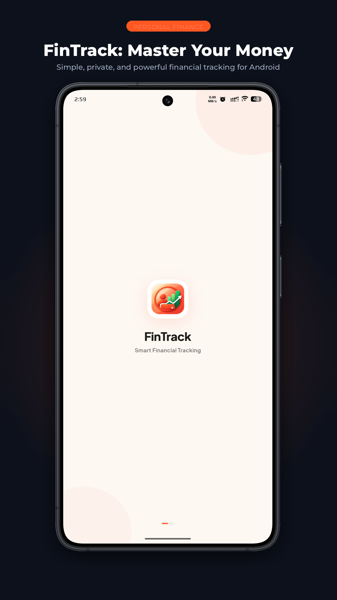

<p align="center">
  
</p>

<h1 align="center">FinTrack</h1>

<p align="center">
  <b>Fast, local-first, privacy-focused personal finance and expense tracker for Android & iOS.</b>
</p>

<p align="center">
  
  
  
  
  
  
</p>

---

## 📱 App Showcase

<p align="center">
  
  
  
</p>
<p align="center">
  
  
  
</p>

---

## ✨ Features at a Glance

### ⚡ Instant Transaction Entry (Quick Add)

- **Pinned Numeric Keypad**: Ergonomic, full-size numpad pinned to the bottom of a uniform bottom sheet — no bouncing or layout shifts.
- **🪄 Smart Quick Entry**: Natural language input parser (e.g., _"Lunch $18.50 with cash"_ or _"Coffee $4.50"_) automatically classifies amounts, categories, and accounts.
- **1-Tap Category Pills**: Horizontally scrollable single row of colorful category icons with an immediate `+ Add New` category button.
- **Exact Date & Time**: Native picker capturing both calendar date and precise timestamp (`h:mm a`).
- **Multi-Type Support**: Seamlessly log **Expenses**, **Income**, and inter-account **Transfers**.

### 📊 Intelligent Dashboard & Safe-to-Spend

- **Real-Time Financial Overview**: Total net worth, monthly cash flow (income vs. expense), and net savings rate.
- **🛡️ Safe-to-Spend Engine**: Proactive daily spending allowance calculator that prevents end-of-month budget shocks.
- **Strict Safe-to-Spend Mode**: Automatically factors in monthly savings goal targets before computing daily allowance.
- **Recent Activity Feed**: Real-time stream of latest transactions with account badges and formatted timestamps.
- **Consistency Streak**: Daily logging streak counter and milestone badges promoting healthy financial habits.

### 📜 Organized Activity Log & Search

- **Grouped Chronological Feed**: Grouped cleanly by date (_Today_, _Yesterday_, or formatted date headers).
- **Time + Account Context**: Every entry details the category, account origin, amount, and exact logging time.
- **Multi-Criteria Filtering**: Filter instantaneously by specific Account, Transaction Type, Date range, or Category.
- **Interactive Details Dialog**: Inspect, edit, delete, or share stylized transaction receipts with a single tap.

### 🎯 Smart Budgeting & Limits

- **Category Monthly Limits**: Set custom spending ceilings across categories (Dining, Groceries, Entertainment, etc.).
- **Visual Progress Indicators**: Color-coded progress bars with overspend alerts and remaining balances.
- **Budget Health Overview**: Real-time percentage tracking for your total monthly budget.

### 📈 Deep Analytics & Visual Reports

- **Interactive Donut Charts**: Powered by `fl_chart` to visualize spending distributions across categories.
- **Monthly Comparison**: Visual bar charts tracking cash flow trends and net balance progression.
- **Category Breakdown**: Granular list ranking expenses by percentage and total amount.

### 🏦 Multi-Account & Net Worth Tracking

- **Multiple Account Types**: Manage Cash wallets, Bank accounts, Mobile wallets (bKash, Nagad, Venmo), and Credit Cards.
- **Double-Entry Transfers**: Transfer funds between accounts with atomic balance updates.
- **Custom Account Customization**: Personalized colors, account icons, and starting balances.

### 🎯 Savings Goals & Milestones

- **Target Tracking**: Set goal amounts, target deadlines, and link goals directly to accounts.
- **Monthly Contribution Suggestions**: Intelligent dynamic calculator determining how much to save each month to hit your target.
- **Visual Milestones**: Celebrate savings progress and achievements.

### 🛡️ 100% Privacy & Offline-First Freedom

- **Zero Telemetry**: No third-party trackers, no accounts to register, and no remote servers watching your transactions.
- **Lightning-Fast SQLite**: Built on Drift with sub-millisecond query execution and zero network latency.
- **Full `.fintrack` Backup & Restore**: One-tap export and import of encrypted, structured JSON backups.
- **CSV Data Portability**: Export your transaction ledger to standard CSV for spreadsheet analysis in Excel or Google Sheets.
- **Theming & Multi-Currency**: Comprehensive Dark/Light theme switching and global currency configuration (USD `$`, EUR `€`, GBP `£`, BDT `৳`, INR `₹`, JPY `¥`, and more).

---

## 🏗️ Architecture & Technology Stack

FinTrack follows a clean, feature-first modular architecture powered by Riverpod and Drift:

```
lib/
├── core/
│   ├── constants/       # App constants, categories, and colors
│   ├── database/        # Drift SQLite schema, DAOs, and type-safe migrations
│   ├── providers/       # Global Riverpod state providers
│   ├── router/          # GoRouter shell route navigation
│   ├── services/        # Smart NLP entry parser, backup/restore, notifications
│   ├── theme/           # Design system tokens, light/dark themes
│   └── utils/           # Date, currency, and numerical formatters
├── features/
│   ├── accounts/        # Account management & net worth
│   ├── budgets/         # Budget ceilings & Safe-to-Spend logic
│   ├── dashboard/       # Central command center & financial cards
│   ├── goals/           # Savings goals & contribution recommendations
│   ├── milestones/      # Habit milestones & achievements
│   ├── navigation/      # Bottom nav bar & layout shell
│   ├── quick_add/       # Numeric keypad & quick transaction bottom sheet
│   ├── recurring/       # Scheduled recurring transactions
│   ├── reports/         # fl_chart analytics & category distribution
│   ├── settings/        # Preferences, backup export/restore, categories
│   ├── splash/          # Animated splash screen
│   ├── streaks/         # Daily logging streak logic
│   ├── subscriptions/   # Recurring subscription tracker
│   └── transactions/    # Activity log, search, filters & receipt sharing
└── main.dart            # App entrypoint & provider scope initialization
```

### Core Libraries

| Package                                                                                                   | Version   | Purpose                                         |
| :-------------------------------------------------------------------------------------------------------- | :-------- | :---------------------------------------------- |
| **[Flutter](https://flutter.dev)**                                                                        | `^3.13.0` | Cross-platform UI toolkit                       |
| **[flutter_riverpod](https://pub.dev/packages/flutter_riverpod)**                                         | `^2.6.1`  | Reactive, compile-safe state management         |
| **[drift](https://pub.dev/packages/drift)** & **[drift_flutter](https://pub.dev/packages/drift_flutter)** | `^2.24.2` | Local SQLite database with reactive streams     |
| **[go_router](https://pub.dev/packages/go_router)**                                                       | `^14.8.0` | Declarative routing with stateful shell support |
| **[fl_chart](https://pub.dev/packages/fl_chart)**                                                         | `^0.70.2` | High-performance interactive financial charts   |
| **[lucide_icons_flutter](https://pub.dev/packages/lucide_icons_flutter)**                                 | `^3.1.17` | Clean, modern vector iconography                |
| **[google_fonts](https://pub.dev/packages/google_fonts)**                                                 | `^6.2.1`  | Typography (Plus Jakarta Sans & Montserrat)     |
| **[share_plus](https://pub.dev/packages/share_plus)**                                                     | `^10.1.4` | Native platform sharing for backup & receipts   |

---

## 🚀 Getting Started

### Prerequisites

- [Flutter SDK](https://docs.flutter.dev/get-started/install) (`>= 3.13.0`)
- [Dart SDK](https://dart.dev/get-dart) (`>= 3.1.0`)
- Android Studio / VS Code with Flutter extension
- Android SDK (API 21+) or Xcode (for iOS builds)

### Installation

1. **Clone the repository**:

   ```bash
   git clone https://github.com/sakincse21/FinTrack.git
   cd FinTrack
   ```

2. **Install dependencies**:

   ```bash
   flutter pub get
   ```

3. **Run code generation** (Drift database tables & DAOs):

   ```bash
   dart run build_runner build --delete-conflicting-outputs
   ```

4. **Run the application**:
   ```bash
   flutter run
   ```

---

## 🧪 Testing & Verification

Run the full automated test suite:

```bash
flutter test
```

Check code quality and static analysis:

```bash
flutter analyze
```

---

## 🎨 Promotional Screenshot Generator

FinTrack includes an automated screenshot composition script that generates device-framed, Play Store-compliant listing graphics:

```bash
python3 scripts/generate_play_store_screenshots.py
```

Generated assets will be saved to `screenshots/play_store/` formatted in **1080 × 1920 (16:9 standard)** with titanium bezels, soft shadows, and ambient colored lighting.

---

## 🔒 Privacy Guarantee

FinTrack is engineered with a strict **local-first** philosophy:

- **No Cloud Required**: All your accounts, transactions, and budgets live exclusively on your device.
- **No Analytics or Trackers**: Your financial data is never monitored, collected, or transmitted.
- **You Own Your Data**: Export your complete database anytime with `.fintrack` or standard `.csv`.

---

## 📄 License

This project is licensed under the **MIT License** — see the [LICENSE](LICENSE) file for details.
